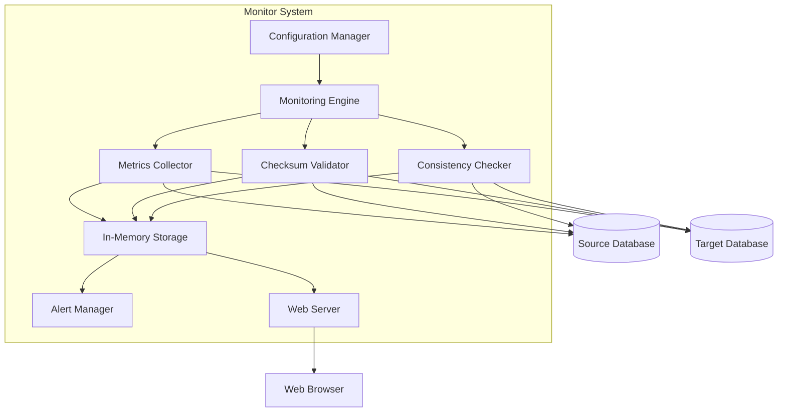

# Design Document

## Overview

The MariaDB Encryption Migration Monitor is a Go-based application that provides real-time monitoring of database encryption migration processes. The system consists of a backend monitoring engine that periodically checks replica lag, performs checksum validation, and verifies data consistency between source and target MariaDB/RDS instances. A web-based frontend provides live visualization of monitoring metrics and alerts.

The application follows a modular architecture with clear separation between data collection, processing, storage, and presentation layers. It uses goroutines for concurrent monitoring operations and WebSockets for real-time updates to the web interface.

## Architecture

### High-Level Architecture



### Component Architecture

The system is organized into the following layers:

1. **Configuration Layer**: Manages application configuration including database connections, monitoring intervals, and alert thresholds
2. **Data Collection Layer**: Handles connections to source and target databases and retrieves monitoring metrics
3. **Processing Layer**: Performs checksum calculations, consistency checks, and replica lag analysis
4. **Storage Layer**: Maintains in-memory state of current and historical monitoring data
5. **Alert Layer**: Evaluates metrics against thresholds and generates alerts
6. **Presentation Layer**: Serves web interface and provides real-time updates via WebSockets

## Components and Interfaces

### 1. Configuration Manager

**Responsibility**: Load and validate configuration parameters

**Interface**:
```go
type Config struct {
    SourceDB      DatabaseConfig
    TargetDB      DatabaseConfig
    MonitoringInterval time.Duration
    ReplicaLagThreshold time.Duration
    WebServerPort int
    TablesToMonitor []string
}

type DatabaseConfig struct {
    Host     string
    Port     int
    Username string
    Password string
    Database string
}

func LoadConfig(path string) (*Config, error)
func (c *Config) Validate() error
```

### 2. Database Connection Manager

**Responsibility**: Manage database connections with retry logic and health checks

**Interface**:
```go
type ConnectionManager struct {
    sourceConn *sql.DB
    targetConn *sql.DB
    config     *Config
}

func NewConnectionManager(config *Config) *ConnectionManager
func (cm *ConnectionManager) ConnectSource() error
func (cm *ConnectionManager) ConnectTarget() error
func (cm *ConnectionManager) GetSourceConnection() (*sql.DB, error)
func (cm *ConnectionManager) GetTargetConnection() (*sql.DB, error)
func (cm *ConnectionManager) HealthCheck() (sourceOK, targetOK bool)
func (cm *ConnectionManager) Close()
```

**Design Decision**: Use connection pooling with `sql.DB` to handle concurrent queries efficiently. Implement exponential backoff for retries (3 attempts with 5-second intervals as per requirements).

### 3. Replica Lag Monitor

**Responsibility**: Measure and track replication lag between source and target databases

**Interface**:
```go
type ReplicaLagMonitor struct {
    connMgr *ConnectionManager
}

type ReplicaLagMetric struct {
    Timestamp   time.Time
    LagSeconds  float64
    Status      string
    Error       error
}

func NewReplicaLagMonitor(connMgr *ConnectionManager) *ReplicaLagMonitor
func (rlm *ReplicaLagMonitor) MeasureLag() (*ReplicaLagMetric, error)
```

**Implementation Approach**: Query `SHOW SLAVE STATUS` on the target database to retrieve `Seconds_Behind_Master` value. For RDS, may need to use CloudWatch metrics as an alternative.

### 4. Checksum Validator

**Responsibility**: Calculate and compare checksums between source and target tables

**Interface**:
```go
type ChecksumValidator struct {
    connMgr *ConnectionManager
}

type ChecksumResult struct {
    TableName      string
    SourceChecksum string
    TargetChecksum string
    Match          bool
    Timestamp      time.Time
    Error          error
}

func NewChecksumValidator(connMgr *ConnectionManager) *ChecksumValidator
func (cv *ChecksumValidator) ValidateTable(tableName string) (*ChecksumResult, error)
func (cv *ChecksumValidator) ValidateAllTables(tables []string) ([]*ChecksumResult, error)
```

**Implementation Approach**: Use `CHECKSUM TABLE` command for MariaDB. For more granular validation, implement custom checksum calculation using `CRC32()` or `MD5()` aggregation over table data.

### 5. Consistency Checker

**Responsibility**: Verify data consistency through row count and basic data comparisons

**Interface**:
```go
type ConsistencyChecker struct {
    connMgr *ConnectionManager
}

type ConsistencyResult struct {
    TableName       string
    SourceRowCount  int64
    TargetRowCount  int64
    Consistent      bool
    Timestamp       time.Time
    Error           error
}

func NewConsistencyChecker(connMgr *ConnectionManager) *ConsistencyChecker
func (cc *ConsistencyChecker) CheckTable(tableName string) (*ConsistencyResult, error)
func (cc *ConsistencyChecker) CheckAllTables(tables []string) ([]*ConsistencyResult, error)
```

### 6. Monitoring Engine

**Responsibility**: Orchestrate monitoring operations on scheduled intervals

**Interface**:
```go
type MonitoringEngine struct {
    config            *Config
    connMgr           *ConnectionManager
    replicaLagMonitor *ReplicaLagMonitor
    checksumValidator *ChecksumValidator
    consistencyChecker *ConsistencyChecker
    storage           *MetricsStorage
    alertMgr          *AlertManager
    stopChan          chan struct{}
}

func NewMonitoringEngine(config *Config) *MonitoringEngine
func (me *MonitoringEngine) Start() error
func (me *MonitoringEngine) Stop()
func (me *MonitoringEngine) runMonitoringCycle()
```

**Design Decision**: Use goroutines with ticker for periodic execution. Run replica lag, checksum, and consistency checks concurrently using separate goroutines to minimize monitoring cycle time.

### 7. Metrics Storage

**Responsibility**: Store current and historical monitoring data in memory

**Interface**:
```go
type MetricsStorage struct {
    mu                  sync.RWMutex
    replicaLagHistory   []ReplicaLagMetric
    checksumResults     map[string]*ChecksumResult
    consistencyResults  map[string]*ConsistencyResult
    connectionStatus    ConnectionStatus
    maxHistorySize      int
}

type ConnectionStatus struct {
    SourceConnected bool
    TargetConnected bool
    LastChecked     time.Time
}

func NewMetricsStorage() *MetricsStorage
func (ms *MetricsStorage) StoreReplicaLag(metric *ReplicaLagMetric)
func (ms *MetricsStorage) StoreChecksumResult(result *ChecksumResult)
func (ms *MetricsStorage) StoreConsistencyResult(result *ConsistencyResult)
func (ms *MetricsStorage) GetReplicaLagHistory(duration time.Duration) []ReplicaLagMetric
func (ms *MetricsStorage) GetCurrentMetrics() *CurrentMetrics
func (ms *MetricsStorage) UpdateConnectionStatus(status ConnectionStatus)
```

**Design Decision**: Use in-memory storage with mutex protection for concurrent access. Limit history to 24 hours (as per requirements) using a circular buffer approach.

### 8. Alert Manager

**Responsibility**: Evaluate metrics against thresholds and generate alerts

**Interface**:
```go
type AlertManager struct {
    config  *Config
    storage *MetricsStorage
    alerts  []Alert
    mu      sync.RWMutex
}

type Alert struct {
    ID        string
    Timestamp time.Time
    Severity  string
    Type      string
    Message   string
    Resolved  bool
}

func NewAlertManager(config *Config, storage *MetricsStorage) *AlertManager
func (am *AlertManager) EvaluateReplicaLag(metric *ReplicaLagMetric)
func (am *AlertManager) EvaluateChecksum(result *ChecksumResult)
func (am *AlertManager) EvaluateConsistency(result *ConsistencyResult)
func (am *AlertManager) GetActiveAlerts() []Alert
func (am *AlertManager) GetAlertHistory() []Alert
```

**Alert Severity Levels**:
- `CRITICAL`: Checksum mismatch, major consistency issues
- `WARNING`: Replica lag exceeds threshold, connection issues
- `INFO`: Connection restored, monitoring started

### 9. Web Server

**Responsibility**: Serve web interface and provide real-time updates via WebSockets

**Interface**:
```go
type WebServer struct {
    config    *Config
    storage   *MetricsStorage
    alertMgr  *AlertManager
    router    *http.ServeMux
    wsClients map[*websocket.Conn]bool
    mu        sync.RWMutex
}

func NewWebServer(config *Config, storage *MetricsStorage, alertMgr *AlertManager) *WebServer
func (ws *WebServer) Start() error
func (ws *WebServer) handleWebSocket(w http.ResponseWriter, r *http.Request)
func (ws *WebServer) handleAPI(w http.ResponseWriter, r *http.Request)
func (ws *WebServer) broadcastUpdate(data interface{})
```

**Endpoints**:
- `GET /`: Serve web interface HTML
- `GET /ws`: WebSocket endpoint for real-time updates
- `GET /api/metrics`: REST endpoint for current metrics
- `GET /api/alerts`: REST endpoint for alerts
- `GET /api/health`: Health check endpoint

## Data Models

### Monitoring Metrics

```go
type CurrentMetrics struct {
    ReplicaLag         *ReplicaLagMetric
    ChecksumResults    map[string]*ChecksumResult
    ConsistencyResults map[string]*ConsistencyResult
    ConnectionStatus   ConnectionStatus
    LastUpdated        time.Time
}
```

### WebSocket Message Format

```go
type WSMessage struct {
    Type      string      `json:"type"`
    Timestamp time.Time   `json:"timestamp"`
    Data      interface{} `json:"data"`
}
```

Message types:
- `metrics_update`: Full metrics update
- `alert`: New alert notification
- `connection_status`: Connection status change

## Error Handling

### Connection Failures

1. **Retry Logic**: Implement exponential backoff with 3 retry attempts and 5-second intervals
2. **Graceful Degradation**: Continue monitoring available metrics if one database connection fails
3. **Status Reporting**: Display connection status prominently in web interface
4. **Error Logging**: Log all connection errors with timestamps and context

### Query Failures

1. **Timeout Handling**: Set query timeouts (30 seconds) to prevent hanging operations
2. **Error Propagation**: Return errors to monitoring engine for proper handling
3. **Partial Results**: Accept partial results if some tables fail validation
4. **Skip and Continue**: Skip failed operations and continue with next monitoring cycle

### Web Server Errors

1. **WebSocket Disconnections**: Handle client disconnections gracefully and clean up resources
2. **Invalid Requests**: Return appropriate HTTP status codes and error messages
3. **Panic Recovery**: Use middleware to recover from panics and log errors

## Testing Strategy

### Unit Testing

- Test each component in isolation with mocked dependencies
- Focus on business logic in validators, checkers, and alert manager
- Test error handling paths and edge cases
- Target: 80% code coverage for core logic

### Integration Testing

- Test database connection manager with test MariaDB instances
- Verify checksum and consistency calculations against known data sets
- Test WebSocket communication and message broadcasting
- Use Docker containers for test databases

### End-to-End Testing

- Set up source and target test databases with replication
- Run full monitoring cycle and verify metrics collection
- Test web interface functionality and real-time updates
- Verify alert generation for various scenarios

### Performance Testing

- Measure monitoring cycle duration with various table sizes
- Test concurrent WebSocket connections (target: 100 simultaneous clients)
- Verify memory usage stays within acceptable limits (target: < 500MB)
- Test with realistic data volumes (tables with millions of rows)

## Security Considerations

1. **Credential Management**: Support environment variables for database credentials, avoid hardcoding
2. **Web Interface**: Implement basic authentication for web interface access
3. **TLS Support**: Support TLS connections to databases
4. **Input Validation**: Validate all configuration inputs to prevent injection attacks
5. **Rate Limiting**: Implement rate limiting on API endpoints to prevent abuse

## Deployment Considerations

1. **Configuration**: Use YAML or JSON configuration file with environment variable overrides
2. **Logging**: Implement structured logging with configurable log levels
3. **Metrics Export**: Consider adding Prometheus metrics endpoint for integration with monitoring systems
4. **Docker Support**: Provide Dockerfile for containerized deployment
5. **Health Checks**: Implement health check endpoint for orchestration systems
